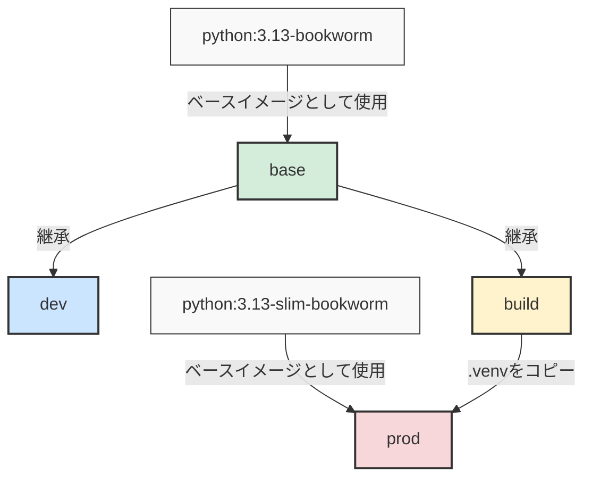

# 概要
開発環境を統一し共通のコーディングルール、言語やライブラリのバージョンのもと開発を行うことはチーム開発を行う際に非常に大切です。
本記事ではそれらを考慮した開発環境を迅速に構築するための一つのプラクティスとして VSCode ✖︎ Devcontainer を使った方法を紹介します。

完成した開発環境に関しては以下で公開しておりますのでテンプレートとして使ったり、一つの参考にしていただければと思います。
https://github.com/schnell3526/python-project-with-devcontainer

この開発環境では様々な環境構築に関わる設定をコード化しており、Docker が使える環境においてステートレスに Python 開発環境 (with Poetry) を作成することができます。
言い換えれば、Docker (および VSCode) さえ使えれば速やかに環境構築することが可能であり、その環境を容易に破棄 & 再作成することが可能で開発環境が持つステートを極力排除し高い再現性を持って開発環境の構築ができます。

# devcontainer の起動手順
利用にあたり、[devcontainer 拡張](https://marketplace.visualstudio.com/items/?itemName=ms-vscode-remote.remote-containers)のインストールが必要なので無ければインストールしてください。
```shell
code --install-extension ms-vscode-remote.remote-containers
```

設定済みの環境を clone したのちに VSCode で起動してください。
template repository の設定もしているのでこれをベースに新しい環境を作ることも可能です！
```shell
git clone git@github.com:schnell3526/python-project-with-devcontainer.git
code python-project-with-devcontainer
```

「⌘+shift+p」を押下して「Reopen in Container」を選択してください。


これを選択することで以下のような Windown に切り替わったら環境構築完了です。


この環境では VSCode の拡張の設定や linter/formatter の設定が完了しており、Python のコードが自動整形され型注釈が無いコードに対してエディタ上で指摘が入るようになります。

試しに以下のようなファイルを作成するとエディタ上で指摘が入ります。
```python:my_package/tmp.py
def add(a, b):
    return a + b
```

指摘を元に以下のように変更すると指摘が外れます。
この時のルールに関しては、pyproject.toml に設定を書くことでカスタマイズが可能です。
この仕組みを利用することで、複数人で同時に開発を行ってもある程度統制の取れたコードを書くことが仕組み的に可能になります。
```python:my_package/tmp.py
"""tmp.py"""


def add(a: int, b: int) -> int:
    """Adds two integers together."""
    return a + b
```

以降では設定をカスタマイズできるようにするために詳しくコードを追っていきます。

# リポジトリ構成
リポジトリ構成は大まかに以下のようになっています。

```shell
.
|-- .devcontainer
|   |-- compose.yaml
|   |-- devcontainer.json
|   `-- lifecycle_scripts
|       `-- initializeCommand.sh
|-- docker
|   `-- Dockerfile
|-- my_package
|   |-- __init__.py
|   `-- main.py
|-- poetry.lock
|-- pyproject.toml
`-- tests
    `-- test_main.py
```

|                  |                                                                                |
| ---------------- | ------------------------------------------------------------------------------ |
| `.devcontainer/` | devcontainer の設定ファイル類                                                  |
| `docker/`        | Docker 関連ファイル                                                            |
| `my_package/`    | python パッケージ名 (flat layout を採用しているが src layout を採用してもよい) |
| `pyproject.toml` | python のパッケージの依存関係や linter/formatter の設定をする                  |

以降ではそれぞれの設定ファイルについて詳しく説明していきます。

# [`docker/Dockerfile`](https://github.com/schnell3526/python-project-with-devcontainer/blob/main/docker/Dockerfile#L1)
Dockerfile はマルチステージビルドを利用した 4 ステージ構成を採用しています。
`base`, `dev`, `build` は `python:3.13-bookworm` をベースとしたステージで開発やビルド用途なので無理なイメージサイズの削減はしていません。
`prod` ステージは slim イメージをベースとしてビルドステージでインストールしたパッケージ類をコピーすることでイメージサイズの削減を行っています。



## base ステージ
base ステージでは build, dev ステージともに利用する Poetry のインストールを行なっています。
環境変数の設定を行い python, pip, poetry の制御を行なっています。
設定の意図については省きますがそれぞれ公式ドキュメントを貼ったので適宜確認してください。

| 環境変数                        | 説明                                                                    |                                                                                       |
| ------------------------------- | ----------------------------------------------------------------------- | ------------------------------------------------------------------------------------- |
| `PYTHONUNBUFFERED`              | 値が設定されていれば出力をバッファリングしない                          | [doc](https://docs.python.org/3.13/using/cmdline.html#cmdoption-u)                    |
| `PYTHONDONTWRITEBYTECODE`       | 値が設定されていればプリコンパイル(.pyc の生成)を行わない               | [doc](https://docs.python.org/3.13/using/cmdline.html#envvar-PYTHONDONTWRITEBYTECODE) |
| `PIP_NO_CACHE_DIR`              | pip のキャッシュを設定しない     [^1]                                   | [doc](https://pip.pypa.io/en/stable/cli/pip/#cmdoption-no-cache-dir)                  |
| `PIP_DISABLE_PIP_VERSION_CHECK` | pip の定期的なバージョンチェックを無効に                                | [doc](https://pip.pypa.io/en/stable/cli/pip/#cmdoption-disable-pip-version-check)     |
| `POETRY_VERSION`                | インストールする Poetry のバージョン                                    | [doc](https://python-poetry.org/docs/#installing-with-the-official-installer)         |
| `POETRY_HOME`                   | Poetry のインストール先                                                 | [doc](https://python-poetry.org/docs/#installing-with-the-official-installer)         |
| `POETRY_VIRTUALENVS_IN_PROJECT` | このオプションを有効にすると .venv がプロジェクトルートに作成される[^2] | [doc](https://python-poetry.org/docs/main/configuration#virtualenvsin-project)        |

poetry のインストールにあたり curl のインストールが必要だったのでこのステージでインストールしています。

## dev ステージ
主に devcontainer として利用するためのステージとして利用しています。

開発に必要なツールはこのステージに適宜追加していくと開発環境でツールが使えるようになります。
```shell
RUN apt-get update \
    && apt-get install --no-install-recommends -y \
        htop \
        jq \
        less \
        sudo \
        tmux \
        tree \
        vim \
    && apt-get clean \
    && rm -rf /var/lib/apt/lists/*
```

このステージの大きなポイントは引数として username や uid を受け取ってビルド時に特定の uid を持つユーザーを作成している点です。

これは devcontainer 利用時にホストの user とコンテナの user の uid や gid が一致しないために、コンテナ内で作成したファイルの編集をホスト側からできなくなる問題があるため、
ホストと同じ uid, gid を引数を通して渡すことでホストと同じ uid, gid を持つユーザーをコンテナ内に作成できるようにするためです。

## build ステージ
build ステージではプロジェクトのビルドを行います。
ポイントは `poetry install` を行う前に、`pyproject.toml` 及び `poetry.lock` のみをコピーしている点です。
```dockerfile
COPY pyproject.toml poetry.lock* ./
```

このようにすることで、インストールするパッケージに変更がないような更新の場合、キャッシュを効かせられるようになりビルド時間を短縮させることができます。

## prod ステージ
prod ステージは本番稼働を想定したステージです。
コンテナを利用してアプリケーションをデプロイする場合、様々なオーバーヘッドが小さくなるためイメージサイズはできるだけ小さいことが望ましいです。
そこで、本番稼働に不必要なファイルを極力排除してイメージの最適化を行なっています。

今回作成したプロジェクトは汎用的な最適化方法として以下を採用しています。
- poetry (パッケージ管理ツール) を本番環境に含めない
- マルチステージビルドを活用して成果物のみをコピーする
- ベースイメージとして slim イメージを利用する

またキャッシュを有効に利用するための工夫として、`my_package` (変更が激しいと予想される) のコピー作業をできるだけ最後に行い、変更が行われてもそれまでのキャッシュが効くように意識しています。


# `.devcontainer/compose.yaml`
devcontainer で利用するコンテナは以下の三種類の指定方法があります。

- リポジトリ名のみ指定する
- Dockerfile を指定する
- docker compose を使う

上に行くほど設定は簡単ですがカスタマイズ性が悪いので、リポジトリ名のみを指定する方法で手軽に利用を初めて最終的には compose 経由での利用を行うことを推奨します。

compose を推奨する理由としては以下が挙げられます。
- `docker compose build` を実行して直接開発用コンテナのビルドを行うことで、devcontainer の設定が悪いのか Docker/compose の設定が悪いのか原因を切り離すことができる
    ```shell
    $ cd .devcontainer/
    $ docker compose build
    Compose can now delegate builds to bake for better performance.
    To do so, set COMPOSE_BAKE=true.
    [+] Building 15.7s (10/10) FINISHED                                                                                                                                                          docker:default
    => [devcontainer internal] load build definition from Dockerfile                                                                                                                                      0.0s
    ...                                                                                                                            0.0s
    [+] Building 1/1
    ✔ devcontainer  Built
    ```
- 後述するホスト-コンテナ間での uid の不一致問題を解決するには compose を使うのが都合が良かったため

# `.devcontainer/devcontainer.json`

## `.devcontainer/lifecycle_scripts`

# `pyproject.toml`

# ホスト-コンテナ間での uid/gid の不一致問題について

[^1]:`NO_CACHE_DIR` に対して `off` の値を設定するとキャッシュが有効になるように思える。これはバグにより以前は falsy な値を設定しないと設定を有効にできなかったためである。現在は値を何かしら設定すれば設定を有効にできるので `on` と設定するのが自然だが後方互換性を考えて `off` を採用した。 [code](https://github.com/pypa/pip/blob/a84b9650a1386e1eb6edef5db0aa7addf2fc2c0c/src/pip/_internal/cli/cmdoptions.py#L689-L715)
[^2]: オプションを無効にすると、`{cache-dir}/virtualenvs` 以下に仮想環境が作成され devcontainer の設定に対して python インタプリタのパスを指定することが難しかったので有効にしている。
